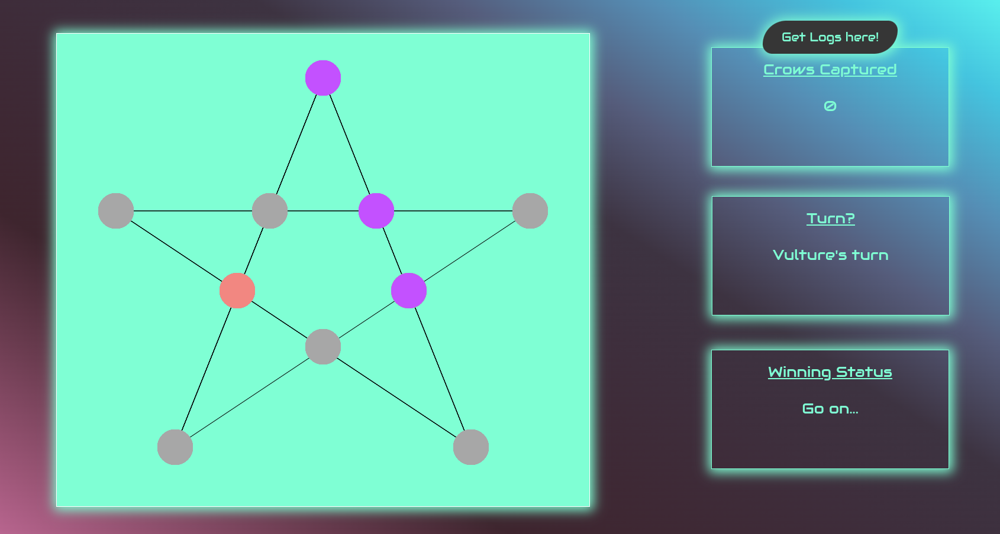
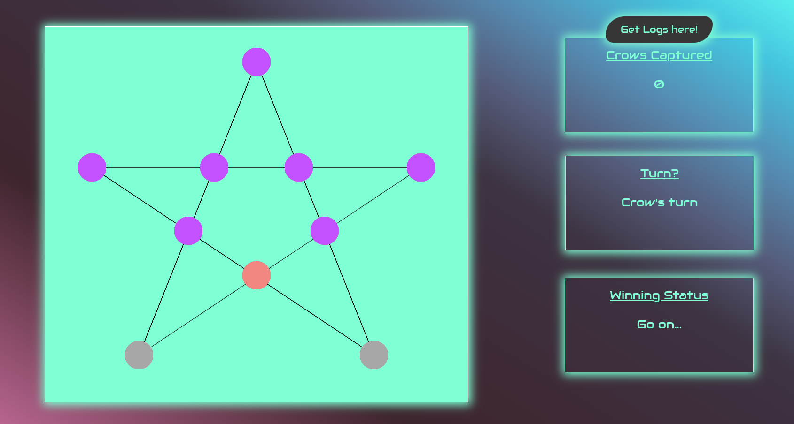

# Kaoaa-Board-Game

## Description

Kaoaa, also known as "Vulture and Crows," is a traditional game from India. It is classified as a hunt game, similar to Len Choa ("Tiger and Leopards") and Fox and Geese. In hunt games, one player with one token faces off against another player with multiple tokens. The tokens in Kaoaa are named after animals, which adds an imaginative spirit to the gameplay. Caw! Caw!

Kaoaa uses a unique pentagram or star-shaped board, reminiscent of the one-person game Pentalpha. Creating your own game board is easy, and players can get creative by decorating it to their preferences.

## Technology

This game, Kaoaa, has been developed using pure HTML, CSS, and JavaScript for the purpose of learning pure JavaScript handling techniques. The primary goal of this project is to provide a valuable learning experience in handling JavaScript. By using native JavaScript for all functionalities, learners can delve into various aspects of the language, including DOM manipulation, event handling, data structures, and algorithm implementation.

### Download Log File

An additional feature of the Kaoaa game is the ability to download the log file at any point during the game. The log file records all the times the player clicked on the playing window and the coordinates where it clicked in the window.

## How to Play Kaoaa

### Objective

The game has different objectives for each player:

- **Crows**: The crows' objective is to surround the vulture and blockade it from moving.
- **Vulture**: The vulture's objective is to capture four crows by jumping over them.

### Setup

To play Kaoaa, you'll need:

- A five-pointed star game board. You can use our printable version or draw your own.
- One token representing the vulture.
- Seven tokens in a different color representing the crows.

### Gameplay

1. **Crows Go First**: Player 1 places one of their crow tokens on any of the ten intersections of the game board.

2. **Vulture Goes Next**: Player 2 places the vulture token on any vacant spot.

3. **Crows Continue "Drop Phase"**: Player 1 keeps dropping their crow tokens one by one on vacant spots until all seven crows are on the board.

### Legal Moves

- **Crows**: Crows may move from one spot to an adjacent vacant spot. Only one move is allowed per turn, and jumping is not allowed for crows during this phase.

- **Vulture**: The vulture may move to an adjacent vacant spot or jump over a crow to capture it. Jumps are only allowed in a straight line. Captured crows are removed from play. The vulture must jump a crow if the opportunity presents itself. Only one jump per turn is allowed.

### Play Continues

Players will take turns, with the vulture moving along the game board while the crow player drops their flock of crows one by one onto the board. Once all seven crows are placed, the crows can begin moving.

### Winning

- The vulture wins if it captures at least four crows by jumping over them.
- The crows win if they manage to trap the vulture in a way that prevents it from making a legal move.

## Screenshot

## Contributions

Contributions to this project are welcome! If you find any issues or have ideas for improvements, please feel free to open an issue or submit a pull request.

Let's make Kaoaa even better together!
